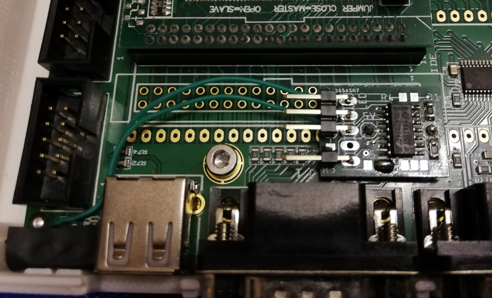

# Amiga 1200 LED Header for Vampire 4 Standalone

I've printed the fantastic Vampire 4 Standalone enclosure by Jörgen Bilander (see https://github.com/jbilander/Vampire_V4_Standalone_Enclosure). It allows to mount an Amiga 1200 LED PCB, however the Vampire 4 SA does not have any header to connect this board. This is why I've made a small adapter PCB that adds an Amiga 1200 LED header to the Vampire 4 SA.

[Video of V4SA booting with A1200 LEDs](img/boot.webm) (Power on, SD card access to load kick rom, Amiga OS booting, Amiga OS mounting/reading SD card)

Adapter:

The board sits on top of the 68000 pins of the Vampire 4 SA and gets +5V and GND from there.

It also needs two wires to the original power and drive LEDs of the V4SA to sense their state.

For using the floppy led for the micro-SD card access a wire to pin 2 of the micro-SD card slot of the V4SA is needed.

It uses an IC that provides 4 opamps. One opamp each is used to sense the power and drive LED state, adding only a neglectable additional load to the outputs of the V4SA. The two remaining opamps are for the floppy LED which can be either be triggered from an active low or an active high signal (selectable using a solder jumper).
The chosen opamps have rail-to-rail outputs which allows to drive the LEDs on the Amiga 1200 LED PCB with a similar voltage as the original Amiga 1200 circuitry.

[Link to PCB on PCBWay](https://www.pcbway.com/project/shareproject/Amiga_1200_LED_Header_for_Vampire_4_Standalone.html)

BOM:
- R1, R2: 82 kOhm 0805 SMD resistor
- IC1: TLV2774CD
- 5V/GND pins: 1 pin of a straight pin header each
- LED pin header: 5 pin angled pin header

Images:

***DISCLAIMER:***

This hardware/software is provided "as is", and you use the hardware/software at your own risk. Under no circumstances shall any author be liable for direct, indirect, special, incidental, or consequential damages resulting from the use, misuse, or inability to use this hardware/software, even if the authors have been advised of the possibility of such damages.
