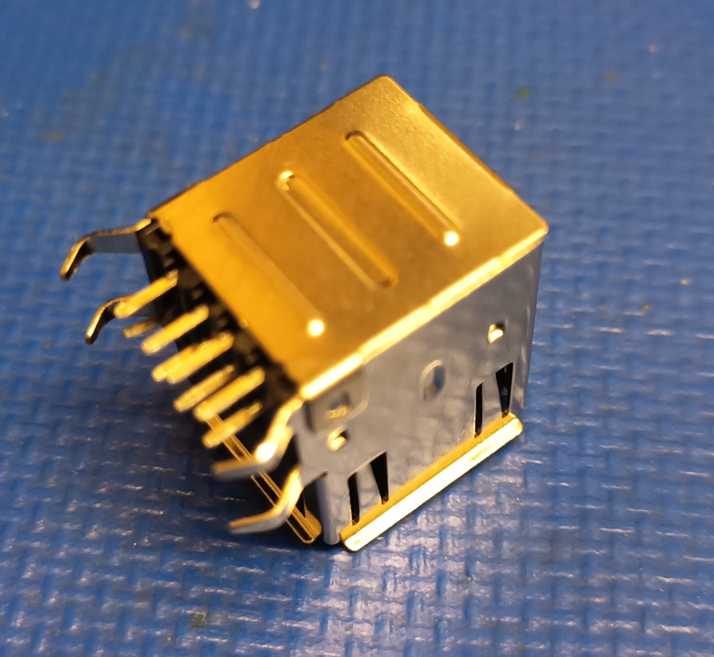
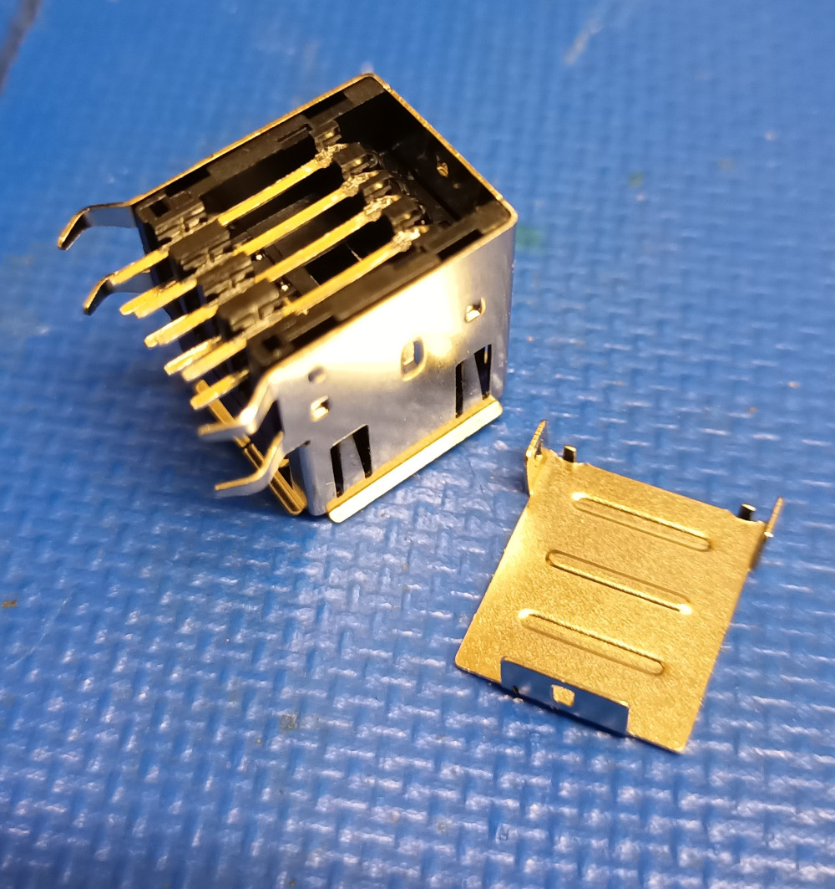
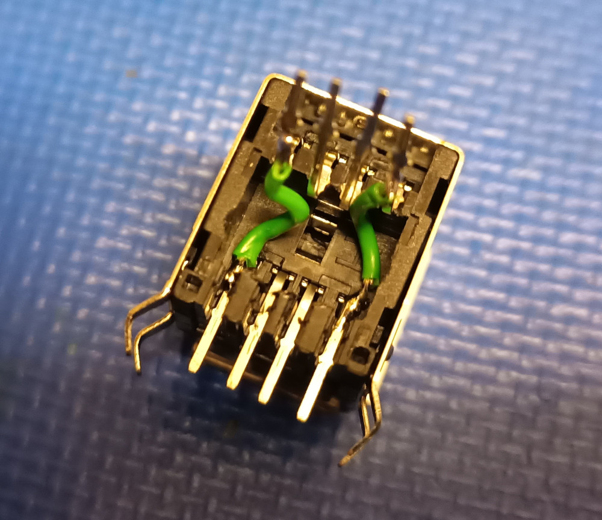
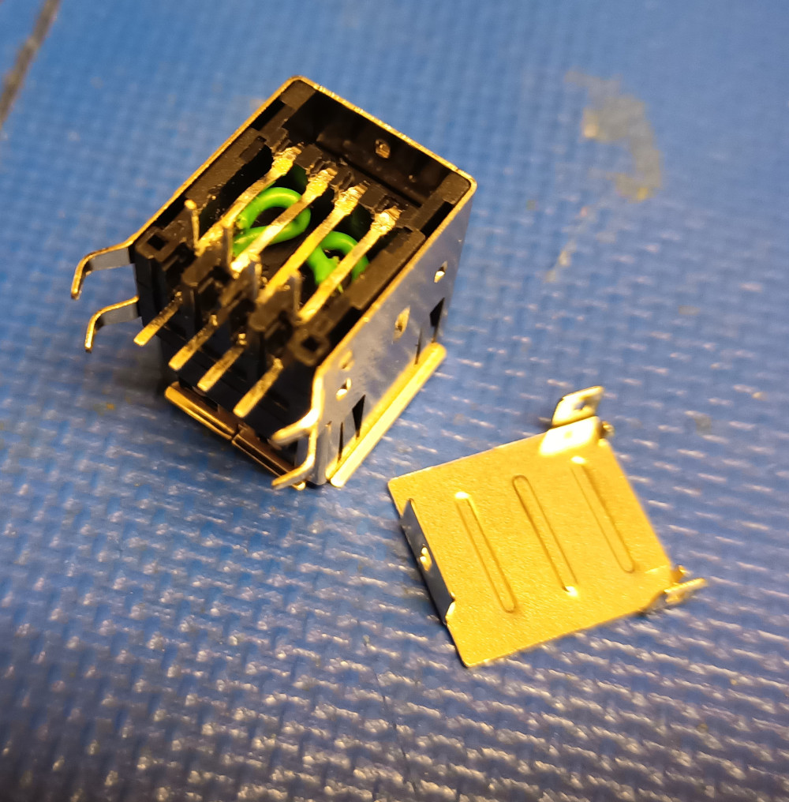
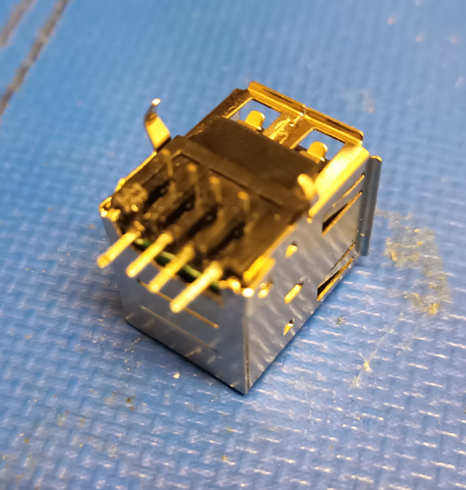
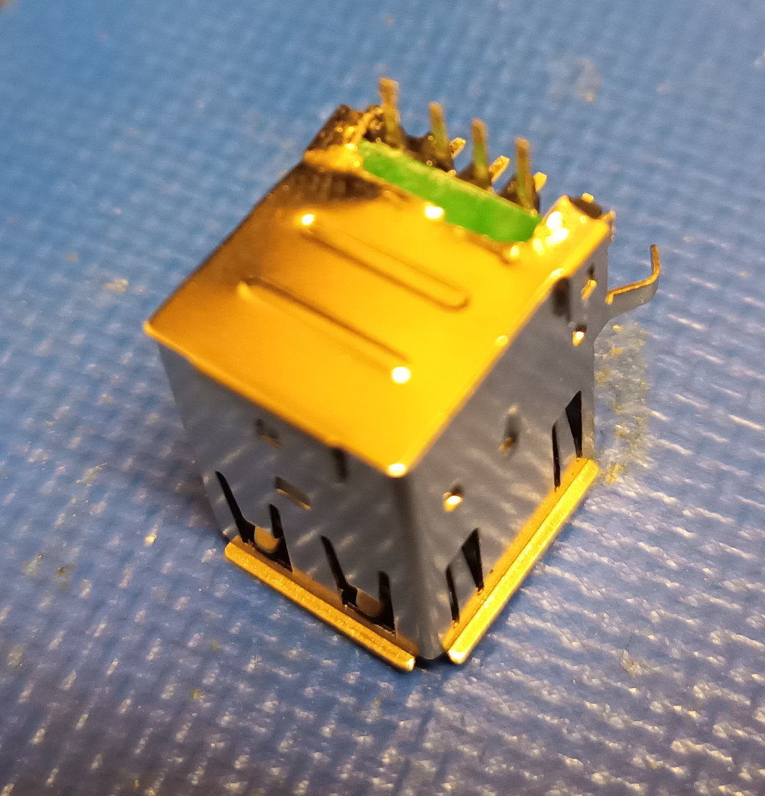
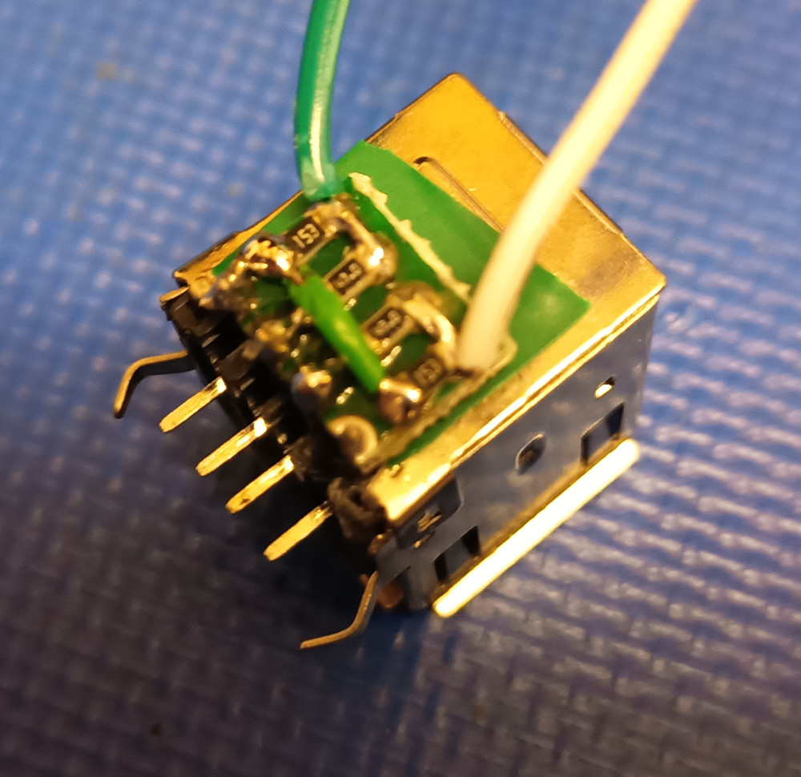
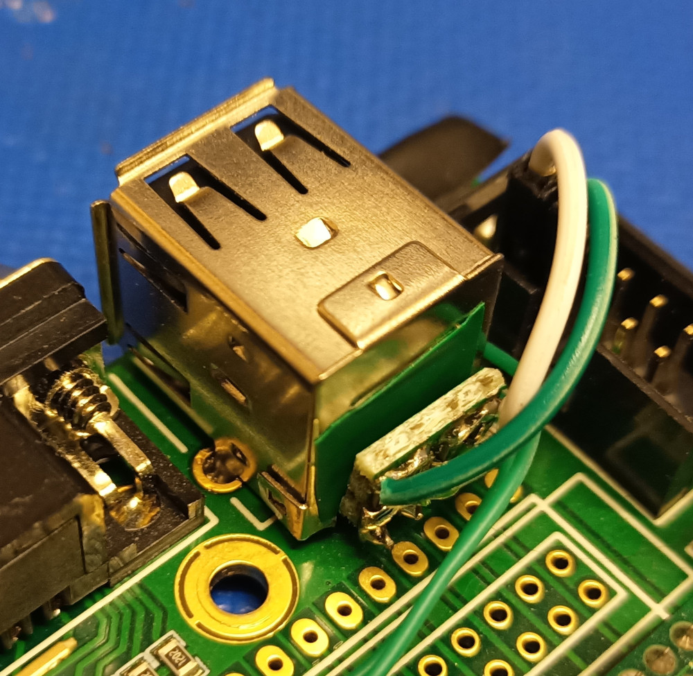
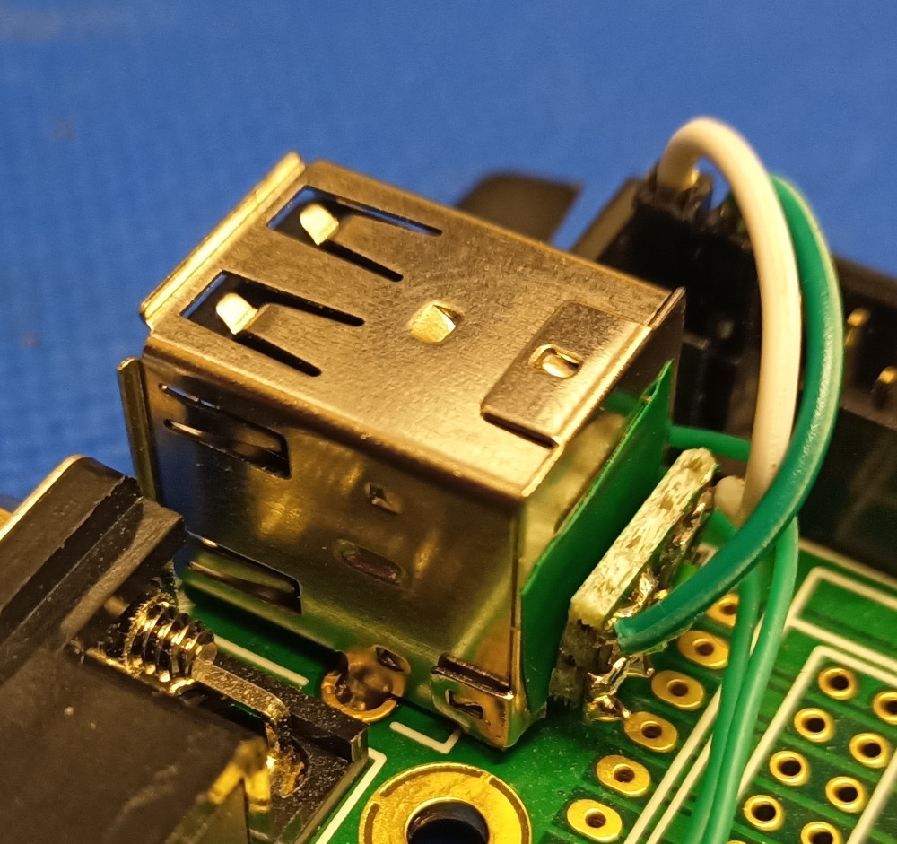

As the official USB upgrade board for the V4 does not fit with the LED board installed I did an alternative USB upgrade:

- Ordered a [dual port USB socket](https://www.conrad.at/de/p/usb-einbaubuchse-2-0-dual-port-buchse-einbau-tc-a-usb-a-2p-203-usb-a-1586531-tru-components-inhalt-1-st-1586531.html):

- Removed the cover on the back:

- Bent up the pins of the upper USB port and connected the +5V and GND pins of the first socket to those of the 2nd socket.

- Bent the pins of the upper USB socket back, and gave them a right angle at the end so that they exit on the back.

- Put some insulation tape on the pins. Cut out an opening on the back cover so that the pins can be routed out on the back. Put on the back cover again, and cut off the two mounting pins at the back. Ensure that there es enough clearance to the resistor R72 on the V4 board!


- Put the resistors (0805), and two cut jumper wires on a perfboard. View from the back:
```
        V4
Pin 2         Pin 1
 |              |
 o----.    .----o
 |    |    |    |
.-.  .-.  .-.  .-.
|R|  |R|  |R|  |R|
|1|  |2|  |3|  |4|
'-'  '-'  '-'  '-'
 |    |    |    | 
 o--------------'
 |    |    |
 |    |    |
GND   D+   D-   +5V
        USB

R2, R3: 47 Ohm
R1, R4: 15 kOhm
        
```
Put some insulation tape on the back of the perfboard and connected it to the pins of the 2nd USB socket.

- Desoldered the original single USB socket of the V4, soldered in the new dual port USB socket and connected the jumper wires.




***DISCLAIMER:***

This hardware/software is provided "as is", and you use the hardware/software at your own risk. Under no circumstances shall any author be liable for direct, indirect, special, incidental, or consequential damages resulting from the use, misuse, or inability to use this hardware/software, even if the authors have been advised of the possibility of such damages.
